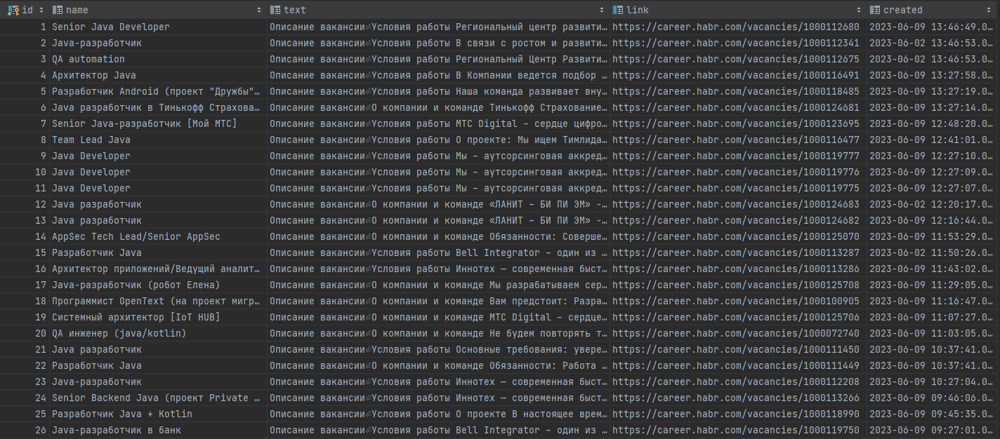

# Проект "Агрегатор вакансий"

## Описание

* Система запускается по расписанию.
  Период запуска указывается в настройках - rabbit.properties.
  Первый сайт https://career.habr.com. В нем есть раздел vacancies.
  Программа должна считывать все вакансии и записывать их в базу.

## Запуск через IDE
Перейте по пути src / main / java / ru / job4j / grabber / Grabber.java

Нажать на кнопку запуска метода main в IDE.
___

## Расширение:
1. В проект можно добавить новые сайты без изменения кода.
2. В проекте можно сделать параллельный парсинг сайтов.
___
## Технологии:
* Java core
* Jsoup
* Maven
* Quartz-Scheduler
* JDBC
* PostgreSQL